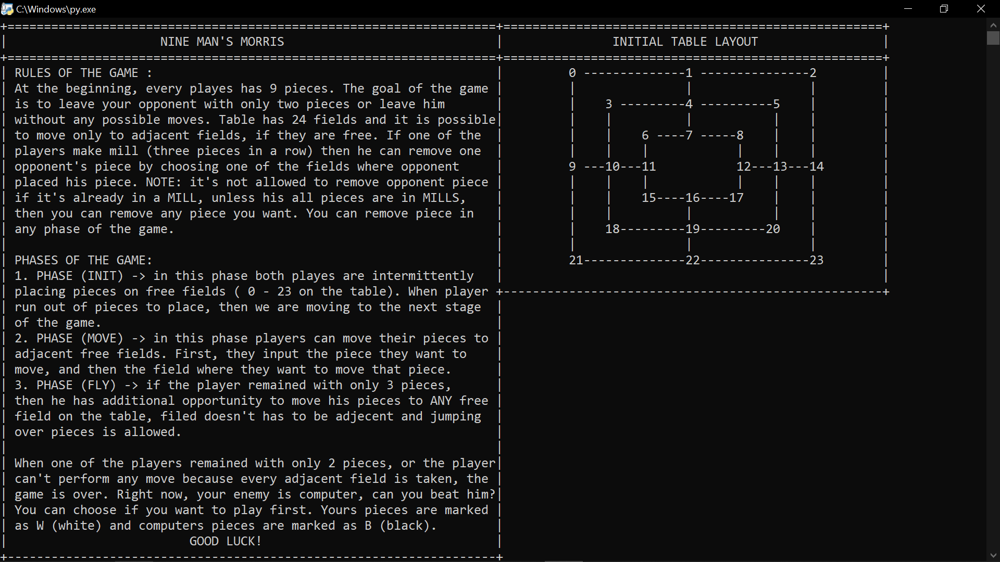
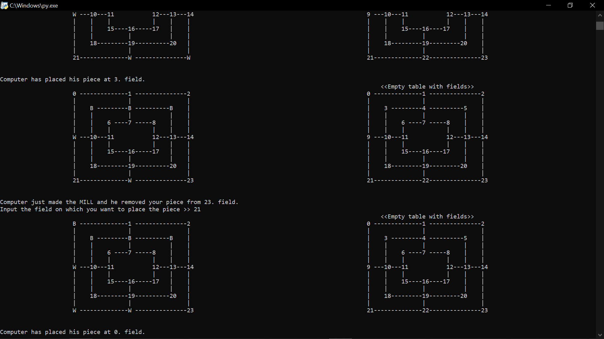

# Nine-Mans-Morris-Python
Popular ancient game Nine Man's Morris implemented in python as console aplication.

## How it was implemented?

- It uses **heuristic** so you can evaluate the state of the game. You decide which parts of the game are most important for you and what coefficients they will have.
I have used coefficients and heuristic from this blog https://kartikkukreja.wordpress.com/2014/03/17/heuristicevaluation-function-for-nine-mens-morris/  ofcourse you can play with this and change this coefficients if you see that computer plays better.\
You can find heuristic in module *heuristic_state_functions.py*

- In order to perform good step, computer has to look ahead in the future to predict the possible outcomes. This was done using **minimax algorithm** with **alpha beta pruning**.
I was using **class State** to keep track of what state of the game is, what move was made and so on...

- I choose the maximum time to perform the step for computer to be **3 seconds**, computer will play better ofcourse if he has more time to explore more possibilities

- There is also the implementation for hackerrank problem https://www.hackerrank.com/challenges/morrisnine/leaderboard  
You can find that in module *hacker_rank.py*

## How can I play this?

- Simple run **main.py**

## Additional prerequisite

- I did use one module that is not par of the standard python, but that was just for the small sound effect at the end of the game.\
You can remove that if you want, or you can install it via  ***python install playsound*** if you haven't already.

## Rules:

## Gameplay screenshot:

## How can i contribute?

Well, there i a lot of to improve on this project, for example:
- you can change heuristic or improve decision-making logic of computer. The module *ai_play.py* contains a lot of "complicated logic"
but feel free to expriment and change anything you want

- you can make GUI on top of this

*Make pull request, i will review that and merge that into project*
